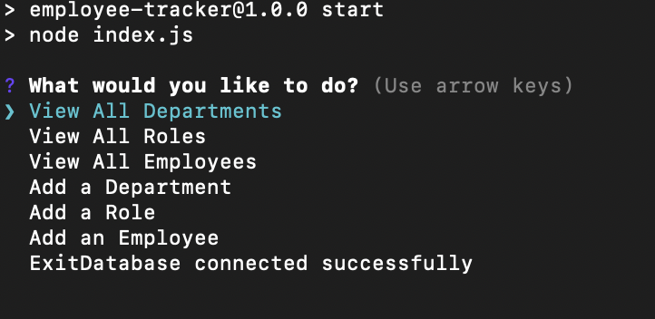
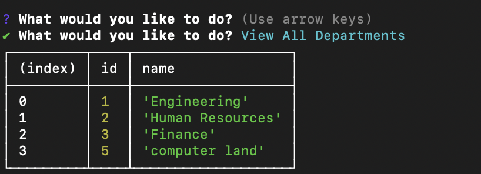
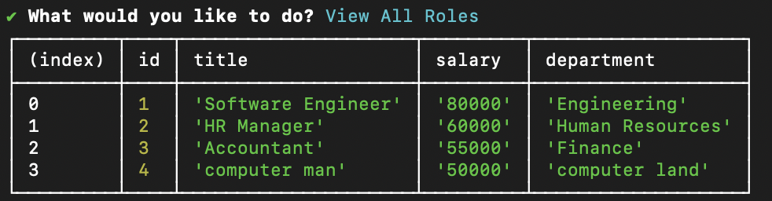
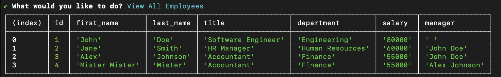
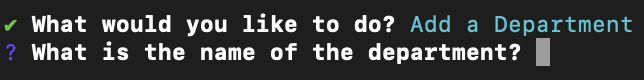
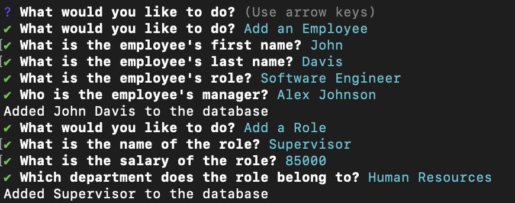

# Employee Tracker

## Overview and Installation

The "Employee Tracker" functions the way its name would suggest. It is an employee database that stores employer and employee information. It can be run from the command line using the npm start command.

## Usage

When the application starts, the user is given a menu prompt. They can view preexisting "Departments," "Roles," and "Employees," or add new data to any of these categories.

When the user wants to view this data, information will be displayed in a table.

The user also has the ability to add new data to any of these categories.

## Contributing

This app was made by Morgan Troper for the Module 10 Bootcamp Challenge. ChatGPT provided assistance and code.

## License
[MIT](https://choosealicense.com/licenses/mit/)
